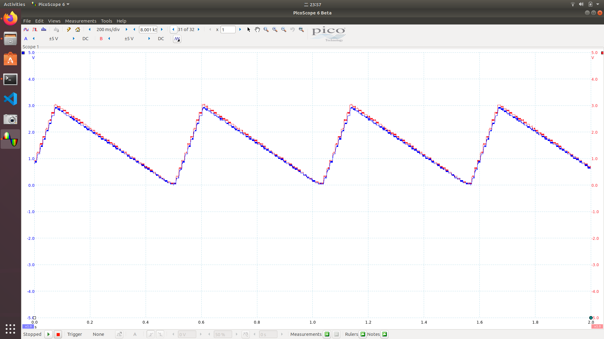
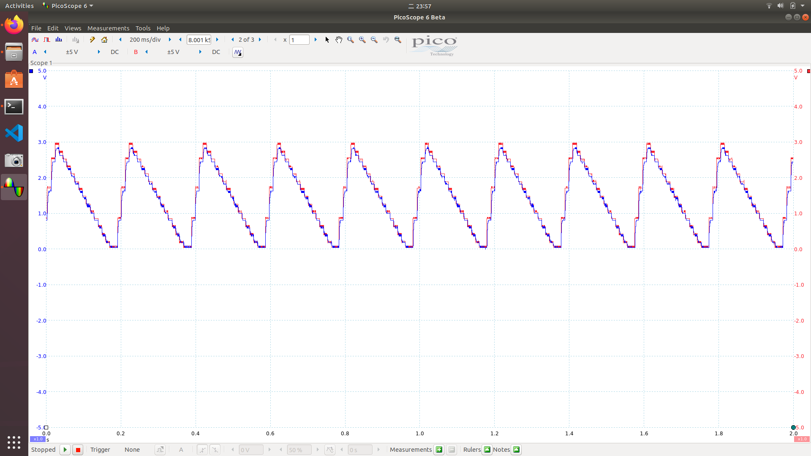
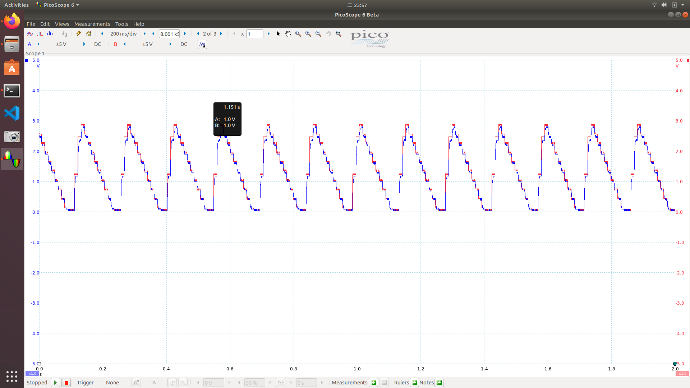
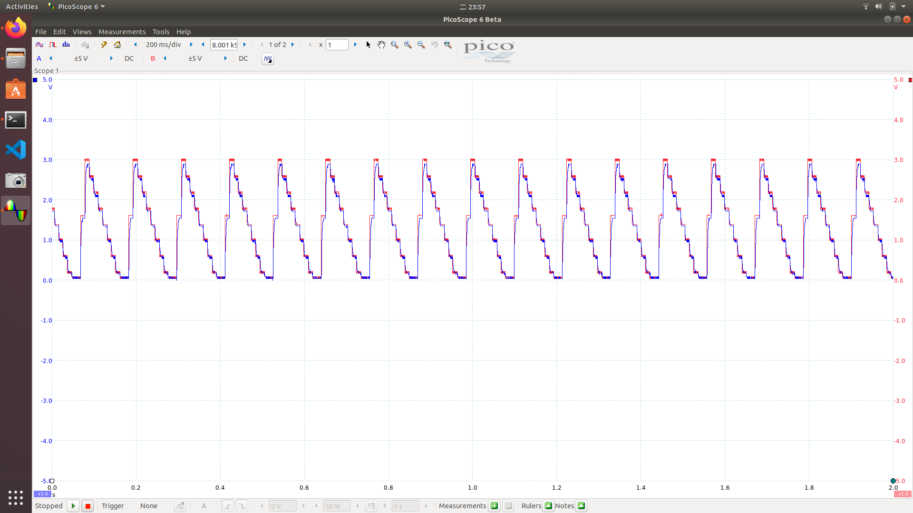
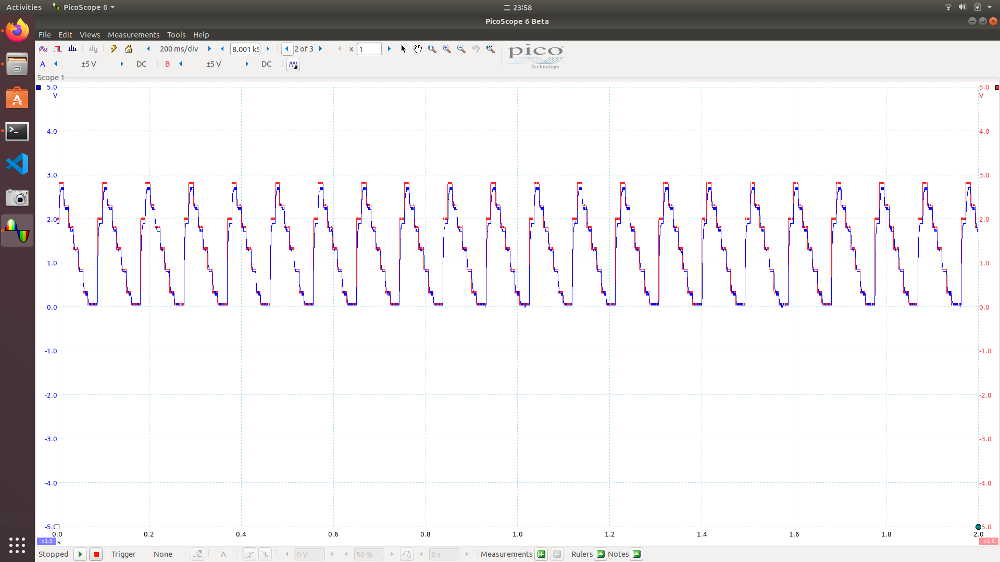
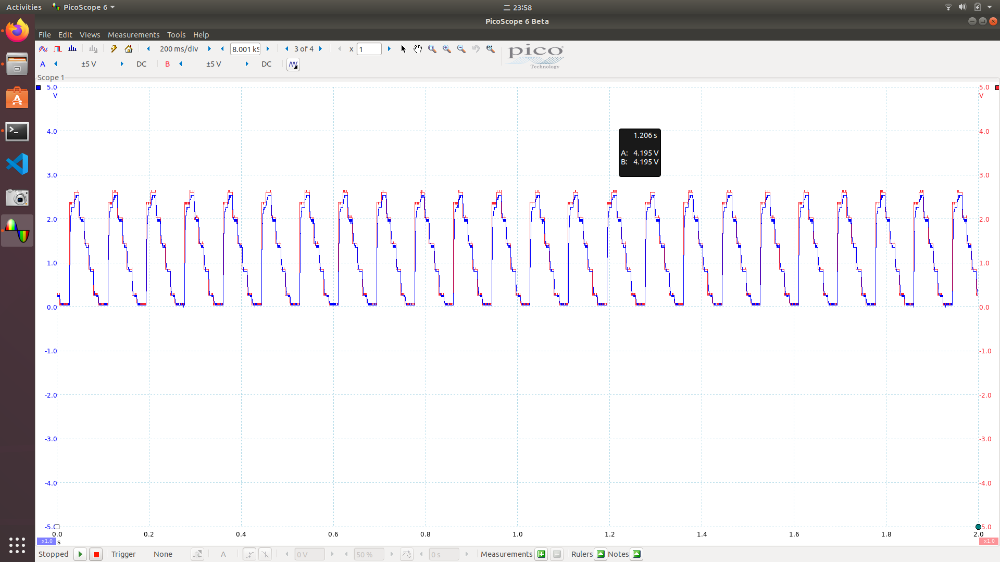
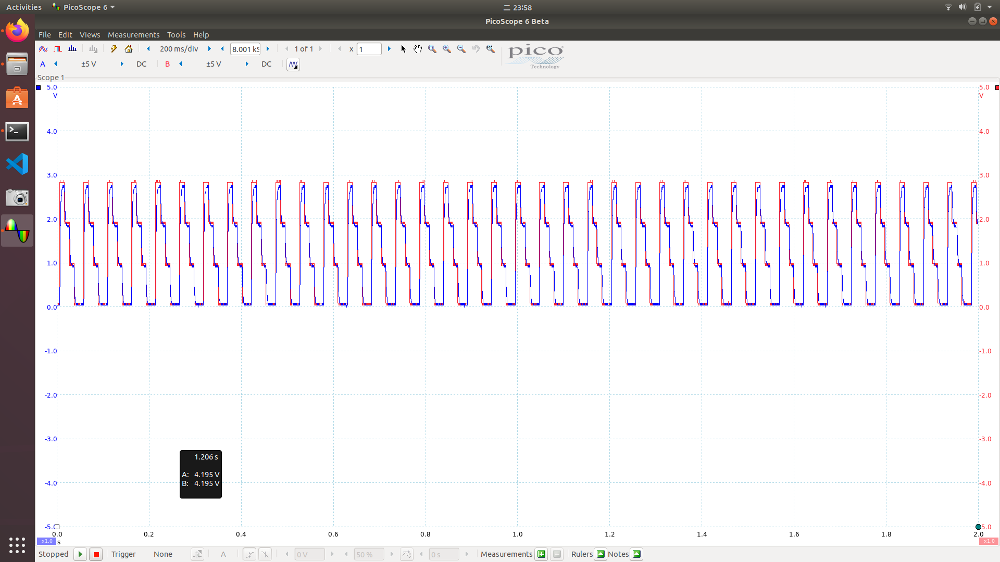
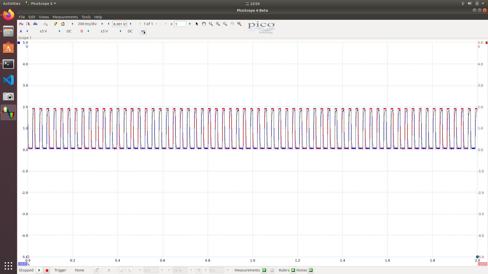

# hw2

## Setup the Program 

1.Create a new Mbed project.

` $ cd ~/ee2405/hw2 `
` $ mbed new hw2 --scm none `
` $ cd hw2 `    

2.Add "4DGL-uLCD-SE" library to the current project.

` $ git clone https://gitlab.larc-nthu.net/ee2405_2021/4dgl-ulcd-se.git `
` $ rm -rf ./4dgl-ulcd-se/.git `
    
3.Add 3 buttons, uLCD, RC circuit to mbed.

    - connect three buttons to the pin of D8 D9 D10

4.Connect picoscope.

5.Start VS code to edit main.cpp.

` $ code main.cpp `

- Initialize a pins to perform analog and digital output functions

```
AnalogOut  aout(PA_4);
AnalogIn ain(A0);
DigitalIn B0(D8);
DigitalIn B1(D9);
DigitalIn B2(D10);
uLCD_4DGL uLCD(D1, D0, D2);
```
- setup display function

```
float f[8] = {20, 56, 81, 106, 131, 156, 250, 500};
int f_cur = 3;
int f_idx = 3;
void display(){
    uLCD.locate(0, 0);
    for (int i=0;i<8;i++){
        uLCD.color(GREEN);
        if (i==f_cur)
            uLCD.color(BLUE);
        if (i==f_idx)
            uLCD.color(RED);
        uLCD.printf("%.1f   \n", f[i]);
    }
}
```

- check buttons

```
    while (1) {
        // check button
        if(B0.read()){
            f_cur  = f_cur + 1;
            if(f_cur>7)
                f_cur = 7;
            display();
            ThisThread::sleep_for(10ms);
        }
        if(B1.read()){
            f_cur = f_cur - 1;
            if(f_cur<0)
                f_cur = 0;
            display();
            ThisThread::sleep_for(10ms);
        }
        if(B2.read()){
            f_idx = f_cur;
            // freq = f[f_idx];
            aout = 0;
            // printf("Current Frequence : %.1f \n\r", freq);
            display();
            ThisThread::sleep_for(10ms);
        }
        
```

- Waveform specification
S  =  mod 1 0 ( 1 + 0 + 6 + 0 + 9 + 1 + 2 + 2 + 1 ) = 2

- set aout 

```
T = 1000/f[f_idx];
        if(index < 0.2*T){
            aout = float(index)/0.2/T*scale;
        }
        else{
            aout = scale*(1- float(index-0.2*T)/0.8/T);
        }
        if(index < T)
            index = index +1;
        else
            index = 0;
```
 

```
adc_data = ain;
        printf("%f\n", adc_data);
        ThisThread::sleep_for(1ms);
```

## Run the Program 

1.Compile and run

` $ sudo mbed compile --source . --source ~/ee2405/mbed-os-build/ -m B_L4S5I_IOT01A -t GCC_ARM -f ` 

2.Press button to select different frequency
    
    - two buttons to select up and down
    
    - Confirm button to comfirm the frequency

3. Plot the waveform and the FFT of the sinewave in the same plot with Python in PC.

` $ sudo python3 fft.py ` 

## Result

###  Picoscope

    20 Hz

 

    56 Hz



    81 Hz



    106 Hz (cutoff frequency)



    131 Hz
    
 

    156 Hz
    
 

    250 Hz
    


    500 Hz




###  waveform and the FFT of the sinewave

  Running ` $ sudo python3 fft.py ` at each frequency will get the following results.

    20 Hz

 

    56 Hz


    81 Hz


    106 Hz (cutoff frequency)


    131 Hz
    
 

    156 Hz
    
 

    250 Hz
    


    500 Hz


