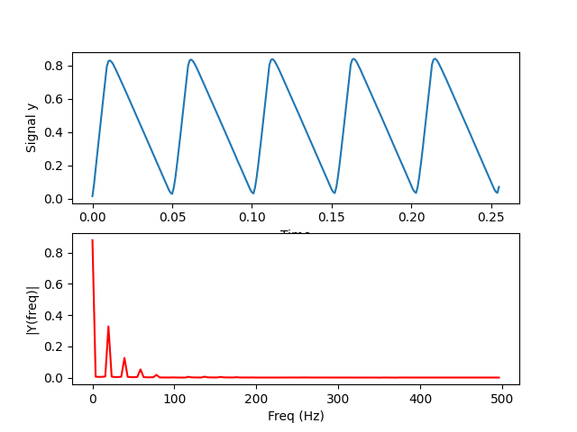
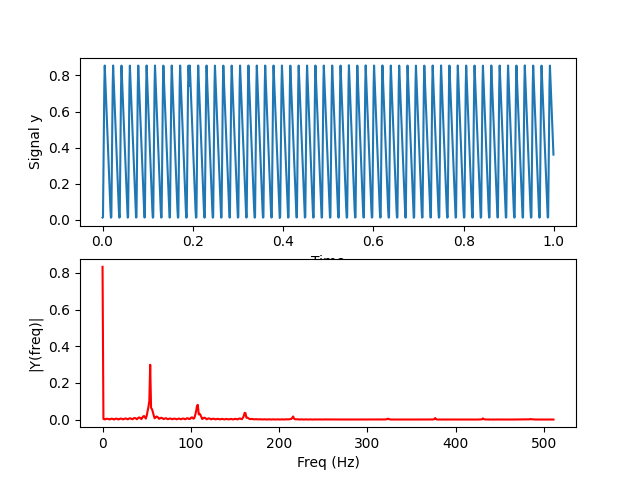
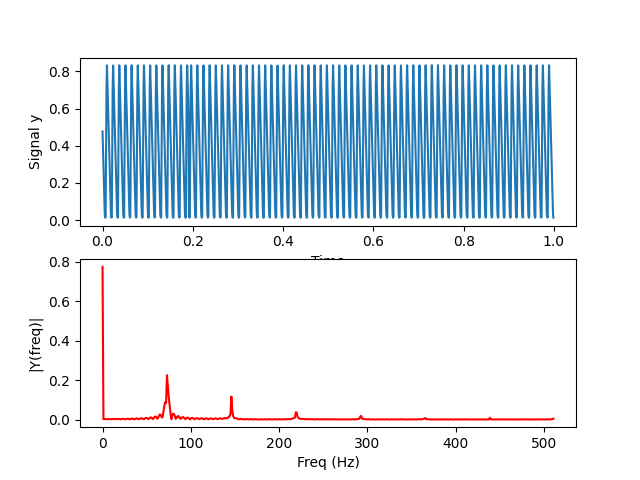
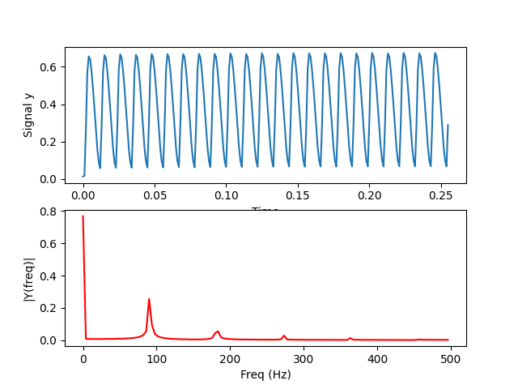
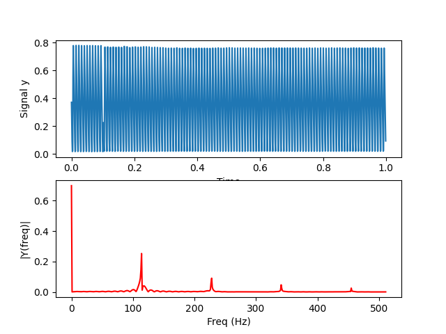
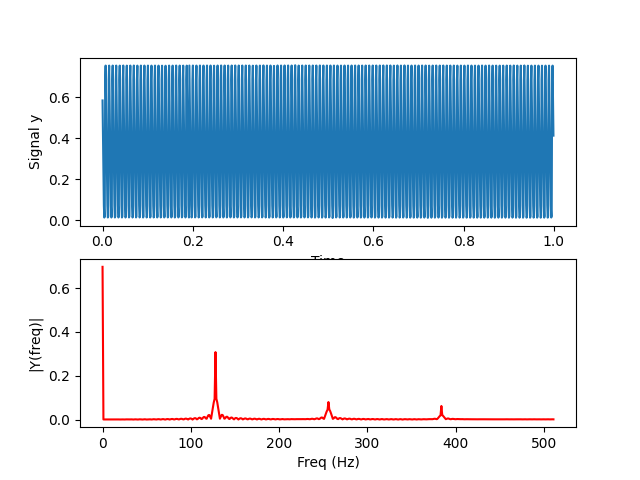
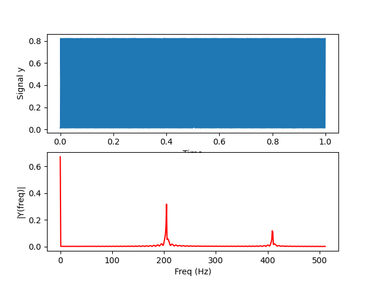
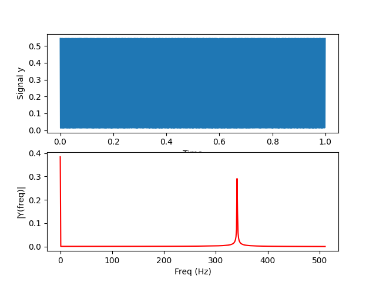

# hw2

## Setup the Program 

1.Create a new Mbed project.

    `$ cd ~/ee2405/hw2`
    `$ mbed new hw2 --scm none`
    `$ cd hw2`    

2.Add "4DGL-uLCD-SE" library to the current project.

    `$ git clone https://gitlab.larc-nthu.net/ee2405_2021/4dgl-ulcd-se.git`
    `$ rm -rf ./4dgl-ulcd-se/.git`
    
3.Add 3 buttons, uLCD, RC circuit to mbed.

4.Connect picoscope.

5.Start VS code to edit main.cpp.

    `$ code main.cpp`
    
## Run the Program 

1.Compile and run

    `$ sudo mbed compile --source . --source ~/ee2405/mbed-os-build/ -m B_L4S5I_IOT01A -t GCC_ARM -f `
    
2.Press button to select different frequency
    - two buttons to select up and down
    - Confirm button to comfirm the frequency

3. Plot the waveform and the FFT of the sinewave in the same plot with Python in PC.

    `$ sudo python3 fft.py ` 

## Result

### - waveform and the FFT of the sinewave

  Running `$ sudo python3 fft.py ` at each frequency will get the following results.

20 Hz

  

56 Hz

  

81 Hz

  

106 Hz (cutoff frequency)

  

131 Hz

  

156 Hz

  

250 Hz

  

500 Hz

  

